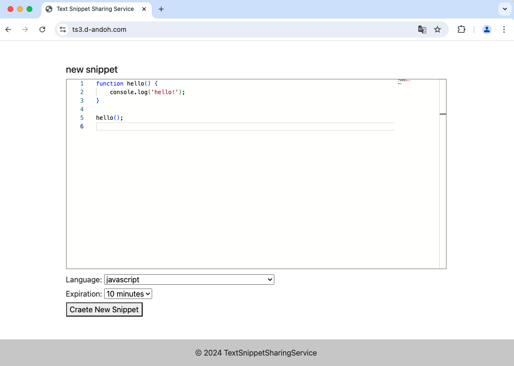
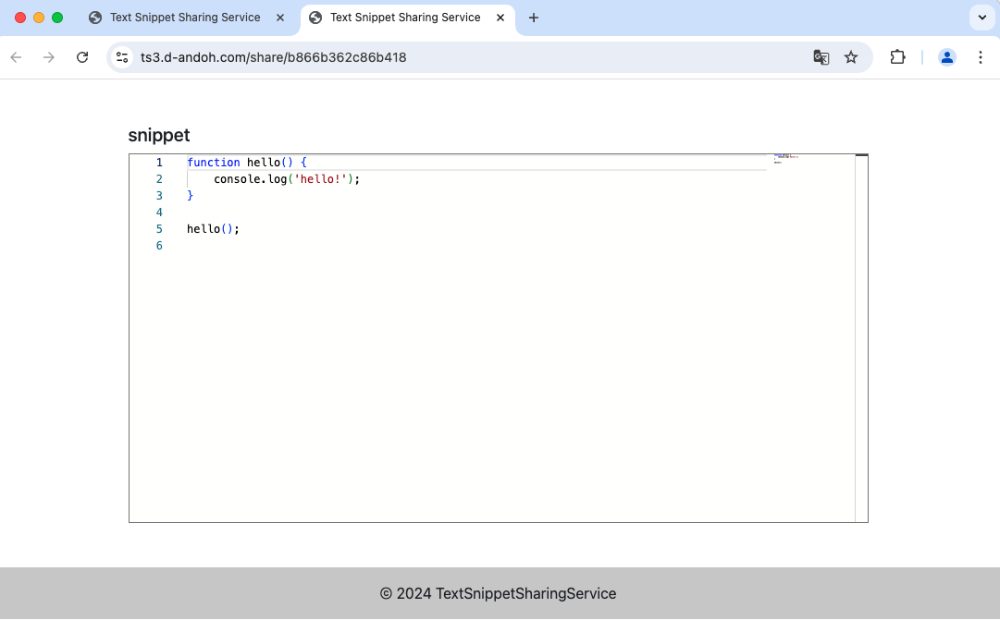

# text-snippet-sharing-service


## URL

https://ts3.d-andoh.com

## About

このアプリケーションは、テキストやコードのシェアリングサービスです。
ユーザーアカウントは不要で、エディタに入力したテキストやコードに一意のURLが生成されます。
また、一般的なプログラミング言語の構文のハイライト機能も備わっています。

生成されたURLは設定した期限を過ぎると無効になります。

## Usage

トップ画面で共有したいテキスト、コードを入力します。
このとき、`Language` で言語を選択すると、その言語に応じた構文ハイライトが適用されます。
また、`Expiration` で生成するURLの有効期間を選択します。
`Create New Snippet` をクリックすると、共有用のURLが生成されます。



生成されたURLに有効期間中にアクセスすれば、閲覧可能です。



## Development

### Set Up

1. DB初期化, ローカルサーバー起動

```
$ cd text-snippet-sharing-service
$ php console migrate -i
$ php -S localhost:8000
```

### Database Migration

1. マイグレーションファイル生成

以下のコマンドを実行すると、`Database/Migrations/yyyy-mm-dd_[unix_timestamp]_[file_name].php` というマイグレーションファイルが生成されます。

```
$ php console code-gen migration --name [file_name]
```

マイグレーションファイルの `up` にマイグレーションロジック、`down` にロールバックロジックを記述します。

```php: Database/Migrations/yyyy-mm-dd_[unix_timestamp]_[file_name].php
<?php

namespace Database\Migrations;

use Database\Migrator\SchemaMigration;

class CreateSampleTeble implements SchemaMigration {
    public function up(): array {
        // マイグレーションロジックをここに追加
        return [];
    }

    public function down(): array {
        // ロールバックロジックを追加
        return [];
    }
}
```

2. マイグレーション実行

```
$ php console migrate
```

3. ロールバック実行

ロールバック時は、`--rollback`（`-r`）オプションを使用します。

```
$ php console migrate --rollback
or
$ php console migrate -r
```

また、ロールバックオプションに続けて整数値を設定すると、その回数分ロールバックを実行します。

```
# 現在のバージョンから2回分ロールバックする
$ php console migrate -r 2
```
